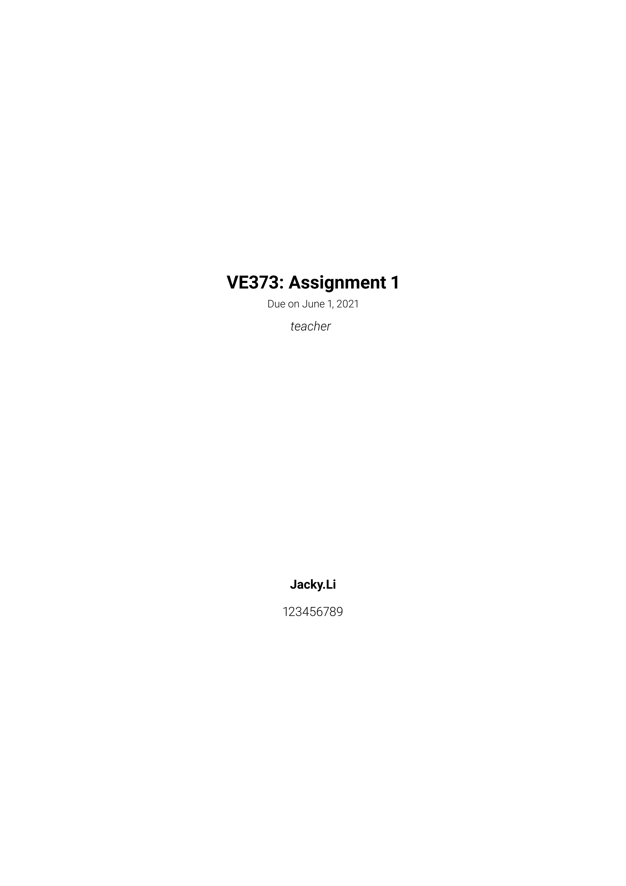
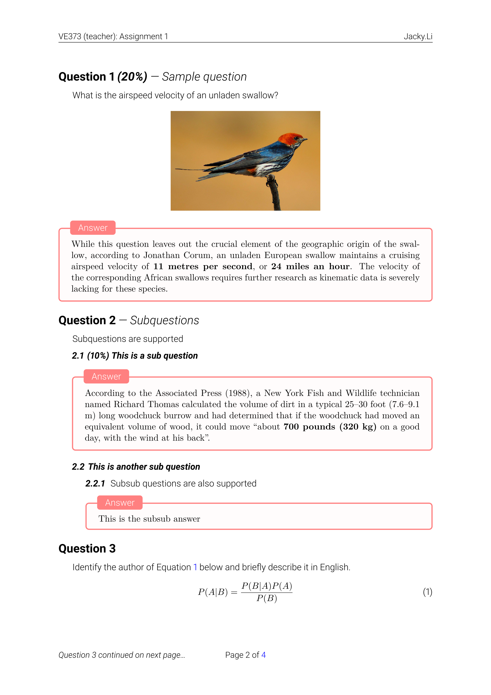
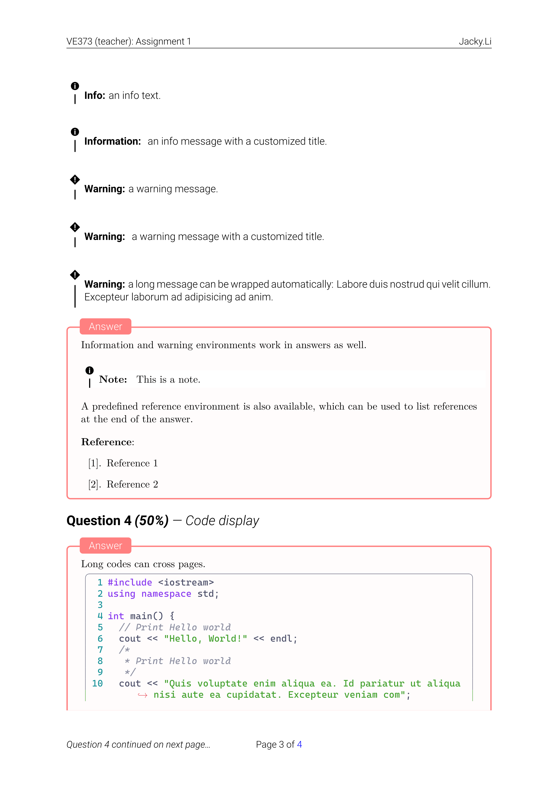
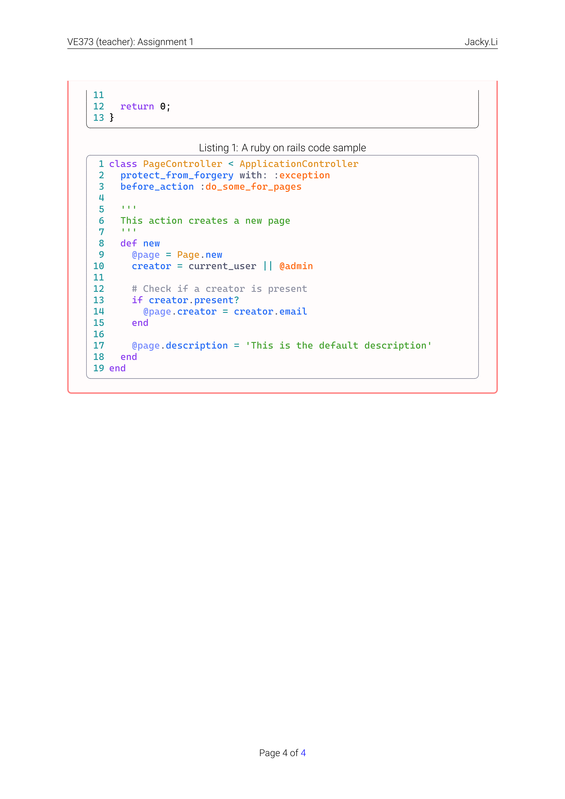

# Homework Template

This is the homework template I used during my undergraduate and graduate years.

The template is modified from the original template [Cleese Assignment](https://www.latextemplates.com/template/cleese-assignment).

For code listings, font [Cascadia Code NF](https://github.com/microsoft/cascadia-code) (NF for [nerd font](https://www.nerdfonts.com/)) is needed. Of course you can change it in `code-style.tex` as you like.

Open source license: [CC BY-NC-SA 3.0](http://creativecommons.org/licenses/by-nc-sa/3.0/) (required by the original template)

## Prebiew

|  |  |  |  |
| :----------------------------------------------------: | :----------------------------------------------------: | :----------------------------------------------------: | :----------------------------------------------------: |

[PDF version](Homework-template.pdf)
